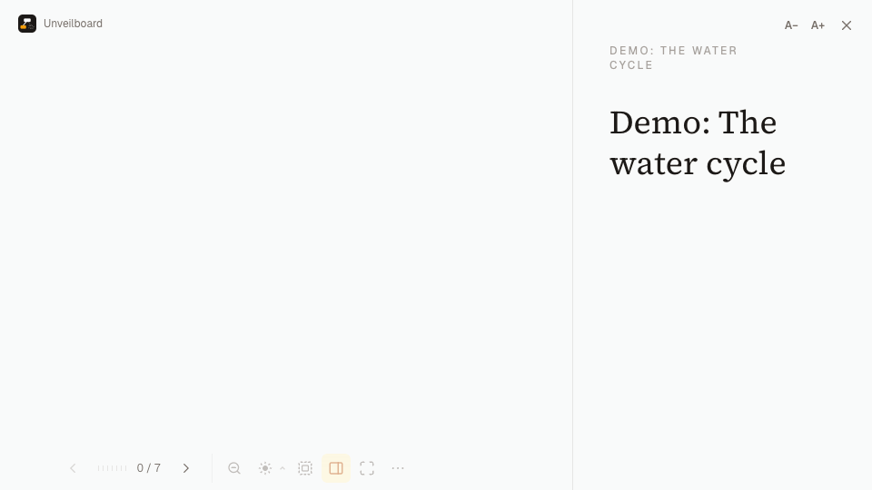

# Unveilboard

*Show your diagrams step by step. Built with [tldraw](https://tldraw.dev).*

**English** · [Français](README.fr.md)



Unveilboard turns a tldraw canvas into a progressive presentation. Instead of showing a whole diagram at once, you reveal it step by step: each step can show, dim, hide or highlight shapes, move the camera, and display a narration text next to the diagram.

It was made for teaching: an audience follows the reasoning more easily when the diagram is built in front of it, and spends less time copying it down.

**Try it:** [unveilboard.com](https://unveilboard.com). No account needed; your diagrams stay in your browser.

> Unveilboard is not affiliated with, or endorsed by, tldraw Inc. "tldraw" is a trademark of tldraw Inc.

## Features

- **Steps**: show, dim, hide, restore, highlight or focus shapes, with entrance effects (fade, rise, draw); collapse or expand tree branches; show an object note.
- **Camera per step**: follow the new shapes, show the whole diagram, or stay put.
- **Narration panel**: a Markdown text for each step, shown next to the diagram (resizable, can be hidden), below it on a phone.
- **Presentation mode**: keyboard and presentation-remote navigation, overview and recenter, laser pointer (color, width and fade-out delay are configurable), hand-drawn masking layer, legend, and an "unlocked" mode to edit the diagram during the presentation.
- **In the classroom**: an audience window for the projector while your screen becomes a presenter view, and a phone remote (see below).
- **Quick sequencing**: create shapes and add them to the current step, or to a new step before or after it, in one click.
- **Trees, mind maps and argument maps** on regular tldraw shapes, with style presets (element types and relations).
- **Object notes**: the longer text about a shape, shown on demand next to the narration.
- **Read-only sharing**: a link that opens the presentation for anyone, and a short link with a QR code to project.
- **Handout**: ☰ › "Handout (print / PDF)…" gives one section per step, the diagram at that step (dimmed shapes in grey) and its narration, to print or save as PDF for students.
- **Examples** on the home page (an argument tree, Kant and Constant on lying, in English or French; the water cycle in English; freedom in French), and a shortcuts help while presenting (<kbd>?</kbd>).
- **Files**: save and open `.tldr` files. The sequence is stored inside the tldraw document, so a `.tldr` file keeps it. In Chrome and Edge, a diagram opened from a file, or saved to one, stays linked to it: every change is written back automatically (<kbd>Ctrl/⌘</kbd>+<kbd>S</kbd> saves at once), so you can work directly on a file in a synced folder (Google Drive, Dropbox, iCloud Drive, OneDrive). A file changed elsewhere is reloaded when you come back to the tab, and never overwritten without asking; reopening a linked file reopens its diagram instead of duplicating it.
- **JSON format**: export a diagram as JSON (types, relations, trees, sequence, all named), or copy it for an AI; import a JSON diagram written by hand, by an AI or by another tool, laid out automatically. See [The JSON diagram format](docs/map-format.md).
- **Working with an AI**: create a diagram, enrich it, write its sequence or review it. ☰ › “Prompt for an AI…” copies a complete prompt (the diagram, its vocabulary, the answer format) for the assistant of your choice, or asks directly the AI chosen in ☰ › “AI settings…”: OpenRouter with your own key (sign in with OpenRouter), a local or remote OpenAI-compatible server (Ollama, LM Studio…), or the instance's AI. The answer is checked (and sent back once for correction if needed), then applied as a single undoable change. ☰ › “Create a diagram from a text…” turns a pasted text, a text or Markdown file, a PDF or a photo (transcribed by the AI) into a diagram with its sequence, and checks every excerpt it cites against the text. ☰ › “Critical review…” lists remarks (automatic checks, and the AI's review) with corrections to apply one by one. From a selected box, “✦ AI…” asks the AI to connect new elements to it (objections, examples, assumptions…), as dimmed suggestions to accept (✓) or reject (✕), or directly. A browser agent can use `window.unveilboard`. See [Working with an AI](docs/map-format.md#working-with-an-ai).
- **Dark mode**, and an **English and French interface**.

## Read-only sharing

"Share" (header of the steps panel, or ☰ menu) gives a link that opens the presentation for anyone: step by step, with the narration, without being able to change the diagram (page `/p`).

- **Link with the diagram inside**, on any instance: the document is compressed into the link, after the `#`, which browsers never send to the server. Nothing is stored, so there is nothing to moderate. Embedded images are left out (they would make the link huge), and later changes need a new link.
- **Published link**, in cloud mode: a short link (`/p/<id>`) to a copy of the last saved version (`shares` table), images included. "Publish the latest version" updates the same link; "Unpublish" disables it. Publishing requires the session; reading is public.
- **Public sharing**, on a local-mode instance with an Upstash Redis store (`KV_REST_API_URL`, `KV_REST_API_TOKEN`, from the Vercel Marketplace): any visitor can publish a short link. Safeguards:
  - only the diagram and its texts are published: clickable links, link cards and embedded images are removed; web images must be `https` and pass the address filter;
  - a deliberately short keyword filter (`src/lib/share/blocklist.ts`, extendable with `SHARE_BLOCKLIST`), so that lesson topics are not blocked;
  - 256 KB max; 3 publications per hour and 10 per day per IP address, 200 per day in total;
  - deletion 30 days after the last publication; `SHARING=off` stops publications at once (existing links stay readable);
  - the management key (update, unpublish) stays in the author's browser, never in the document.
- **Reports**: the reader of a published link has a "Report" button; the form sends an email to `REPORT_EMAIL` through Resend (`RESEND_API_KEY`), and the address never leaves the server. To remove a public share: delete the key `share:<id>` in the Upstash console.
- **QR code**: next to a published short link, the "QR code" button shows it full-window, to project it so that students open the presentation on their phones. Always black on white, even in dark mode, to stay readable through a projector. The link with the diagram inside is too long for a QR code.

The IP address comes from the `X-Forwarded-For` header: behind Vercel it cannot be forged; when self-hosting, put the app behind a proxy that sets it.

## In the classroom

**Dual screen.** While presenting, ⋯ › "Project on a second screen" opens an **audience window** for the projector. On Chrome and Edge it moves itself to the second screen (the browser asks for permission once); elsewhere, drag it to the projector. Click "Fullscreen" (or press F) there.

- The projector shows the diagram only; the narration appears on demand ("Narration on the screen" checkbox).
- It follows the presenter's screen: steps, overview and recenter, laser, hand-drawn masking layer, opened notes, legend, and edits made in unlocked mode.
- The presenter's screen becomes a presenter view: timer (click to reset), next step, narration and notes.
- A key pressed in the audience window (presentation remote, keyboard) acts as if pressed on the presenter's screen, except F.
- No server: both windows, in the same browser, talk through a `BroadcastChannel` and share the document through tldraw's local cache (`src/lib/presentation/screen.ts`, page `/d/<id>/screen`).

**Phone remote.** While presenting, ⋯ › "Phone remote" shows a QR code: once scanned, the phone becomes a remote (previous, next, overview, recenter) that also shows the step's narration, the next step and a timer, and keeps its screen on. The two devices connect directly (WebRTC): PeerJS's public service only puts them in touch, and nothing goes through the site's server. The computer's random identifier is in the address fragment (`/r#…`): it is what gives control.

The direct connection can fail on some networks (school Wi-Fi that isolates devices, 5G behind carrier-grade NAT, UDP filtering): the app says so, and otherwise shows the path it got (same local network, or through the Internet). The safest option in class: connect the computer to the phone's hotspot. An HTTPS fallback relay (through Upstash) may be added if failures are frequent.

**On a phone**, in portrait, the narration moves below the diagram; in landscape, it stays beside it, narrower.

## Trees

Select a box: <kbd>Tab</kbd> adds a child (and starts a tree), <kbd>Enter</kbd> adds a sibling. While typing in a node, <kbd>Enter</kbd> confirms (<kbd>Shift</kbd>+<kbd>Enter</kbd>: line break) and <kbd>Tab</kbd> goes on with a child.

- The layout is automatic; a node moved by hand keeps its offset (and drags its branch). "Tidy up" clears the offsets.
- Direction: to the right, left, down, up, or on both sides (balanced mind map: a new child of the root goes to the less loaded side, and a branch dragged to the other side of the root stays there).
- Collapsing a branch hides it while editing. The collapsed state of the document is the starting state of the presentation; the "Collapse / Expand branch" actions change it during the sequence. Collapsing moves nothing: the branch keeps its place.
- Deleting a node deletes its branch (undoable).
- **Argument map** ("Argument map" button): the selected box becomes the thesis under discussion ("Thesis" label). <kbd>Tab</kbd> offers what to add to it (Justification · supports, Objection · objects to…; keys 1 to 9 then a, b…, 0 for none). The branch takes the style and direction of the relation (toward the parent by default: "the premise supports the thesis"; toward the child for implies, presupposes, raises), and the new node the associated type (Example for "illustrates", Assumption for "presupposes"…). <kbd>Enter</kbd> adds a sibling with the same relation.
- In an argument tree, **the shape tells the type, the color tells the function**: a connected node takes the color of its relation (stroke and light fill) and its label shows its function only (Justification, Objection, Refutation, Answer, Explanation, Implication, Presupposition, Example, Definition, Problem, Distinction). Green is reserved for support.

## Style presets

To build an argument map step by step, see the guide [Building argument maps](docs/argument-maps.md): element types, relations, definitions and examples.

Named styles, at the top of the style panel: **element types** for shapes (Statement, Assumption, Evidence, Concept, Distinction, Question, Problem, Example, Quote) and **relations** for arrows (supports, objects to, refutes, answers, explains, implies, presupposes, illustrates, defines, raises, and between concepts: is distinct from, is opposed to, is akin to). A support or objection arrow can specify its type of reasoning (deduction, induction, analogy…). They are only ordinary tldraw properties (geometry, color, stroke…), plus a `meta.preset` mark.

- A click applies the preset to the selected shapes or arrows; with nothing selected, a type arms the shape tool: the next shape drawn gets it.
- Each type has its geometry (Concept: oval, Question: diamond, Problem: hexagon, Assumption: cloud, Evidence: parallelogram, Quote: frameless, serif, with quotation marks…) and a label above the shape ("STATEMENT · Hobbes", with the modality as a pill: descriptive / normative): source (author, theory, position) and modality are entered in the side panel. Labels are drawn by the app: without it, the diagram keeps its shapes and colors.
- Shared by all your diagrams: `settings` table in cloud mode, IndexedDB in local mode. Each diagram keeps a copy of the presets it uses, to stay readable elsewhere (and in shared links).
- ☰ menu › "Style presets…": rename, reorder, shape and label of element types, direction and child type of relations, update or create from the selection, hide a preset (checkbox: it stays usable in existing diagrams), hide the palette or the labels, restore the default presets.
- While presenting, <kbd>L</kbd> shows the legend of the element types and relations used.

## Object notes and narration

The development of an object (long quote, explanation) does not clutter the diagram: it is written in the side panel ("Object note") and shown during the presentation in its own tab of the side panel, next to the narration: on double-click on the object (a ¶ mark shows the objects that have one), or at a step with the "Show the note" action (the note then shows at once, the narration stays one tab away). <kbd>Tab</kbd> switches tabs. The "collapsible details" of earlier versions are converted into notes when a document is opened.

**Writing narration and notes**: Markdown (headings, lists, links, tables, quotes, images; a line break is a line break), with a toolbar, <kbd>Ctrl/⌘</kbd>+<kbd>B</kbd> / <kbd>I</kbd> / <kbd>K</kbd> (link), a preview and a large editor. A pasted or dropped image is uploaded (Vercel Blob) or, failing that, stored in the document as a tldraw asset (`asset:…` in the text, 1 MB max).

**Text size of the side panel**: each diagram has its default size. While presenting, <kbd>+</kbd> / <kbd>−</kbd>, <kbd>Ctrl</kbd> + wheel (or pinch) over the panel and the A− / A+ buttons adjust it for the session; the "n %" button keeps it as the diagram's default, <kbd>0</kbd> goes back to it.

## Presentation shortcuts

`→` / `Space` / `PageDown` next · `←` / `PageUp` previous · `Home` / `End` · `O` overview · `C` recenter · `K` laser · `M` masking layer · `N` narration · `+` / `−` / `0` (or Ctrl + wheel) side panel text size · `Tab` narration / notes · `L` legend · `F` fullscreen · `?` shortcuts help · `Esc` exit (the first `Esc` turns the laser off)

The ⋯ menu of the presentation bar holds the less frequent actions: recenter, shortcuts help, unlock, project on a second screen, phone remote. Unlocking brings back the tldraw interface to edit the diagram; only `PageUp` / `PageDown` then move between steps.

## Languages

The interface exists in English and French (EN · FR selector on the home and login pages); by default it follows the browser's language, and the choice is kept in a cookie. tldraw's own interface follows the same language. Texts are in `src/i18n/`: `en.ts` is the reference, and TypeScript flags any key missing in `fr.ts`. Adding a language means adding one file. The content of diagrams is never translated; only defaults follow the language (titles, default presets, example: liberty in French, the water cycle in English).

## Dark mode

In the editor, the app's panels (steps, narration, toolbars) follow the color scheme chosen in tldraw's preferences: light, dark or system. The home, login and legal pages follow the system. In dark mode, the Tailwind palette is redefined in `globals.css` (`dark-palette` utility: inverted grays), so interface colors go through its variables (`bg-white`, `var(--color-stone-500)`…), never hard-coded values.

## Two storage modes

The mode depends on whether `DATABASE_URL` is set:

- **Local mode** (no `DATABASE_URL`): no database and no password. Diagrams are stored in each visitor's browser (IndexedDB). "Save as…" (steps panel or ☰ menu) creates a `.tldr` file, sequence included; "Open a .tldr file…" (home or ☰ menu), or a drag and drop on the home page, opens it as a new diagram. This is the mode for sharing the app with a simple URL.
- **Cloud mode** (with `DATABASE_URL`): diagrams are stored in Postgres (e.g. [Neon](https://neon.tech)), available on all your devices, and access is protected by a password. This is meant for a personal instance for now: there are no user accounts yet.

## Running locally

Local mode needs no configuration:

```bash
pnpm install
pnpm dev
```

If your `.env.local` sets `DATABASE_URL` (cloud mode), `pnpm dev:local` still starts the app in local mode, as on the public instance.

Cloud mode, with a local Postgres (e.g. Postgres.app):

```bash
pnpm install
createdb unveilboard
cp .env.example .env.local   # then set DATABASE_URL, APP_PASSWORD, SESSION_SECRET
pnpm db:migrate
pnpm dev
```

## Tests

```bash
pnpm test         # unit tests (Vitest): sequence engine, trees, presets, sharing
pnpm test:e2e     # end-to-end tests (Playwright), in local mode, on a dev server started on port 3100
```

The first time: `pnpm exec playwright install chromium`. To reuse a dev server that is already running: `E2E_BASE_URL=http://localhost:3000 pnpm test:e2e`. The phone remote test uses PeerJS's public service and only runs with `E2E_PEERJS=1`. CI (GitHub Actions) runs types, lint, unit and end-to-end tests.

## Deploying (Vercel)

- **Local mode**: import the repository into Vercel and set `TLDRAW_LICENSE_KEY`. That's all.
- **Cloud mode**:
  1. Create a Postgres database (e.g. Neon).
  2. Apply the migrations with the **direct** (non-pooled) connection URL, in single quotes because it contains `&`:
     `DATABASE_URL='postgresql://…/neondb?sslmode=require' pnpm db:migrate`
     After that, each deployment applies new migrations before building (`scripts/migrate.mjs`), with `DATABASE_URL_UNPOOLED` if set (the Neon integration for Vercel sets it), otherwise `DATABASE_URL`. `SKIP_DB_MIGRATE=1` turns this off.
  3. On Vercel, set `DATABASE_URL` (the **pooled** URL, with `-pooler` in the host), `APP_PASSWORD`, `SESSION_SECRET` (`openssl rand -base64 48`) and `TLDRAW_LICENSE_KEY`.
  4. Optional: add a Vercel Blob store (`BLOB_READ_WRITE_TOKEN`) to store images outside the document.

`TLDRAW_LICENSE_KEY` is read at runtime, so changing it takes effect without a rebuild. Without a valid key covering your domain (including `www.` if you use it), tldraw hides the editor a few seconds after it loads.

Optional services and settings (details in `.env.example`):

| Variables | Purpose |
|---|---|
| `KV_REST_API_URL`, `KV_REST_API_TOKEN` | Upstash Redis: public sharing on a local-mode instance |
| `SHARING=off`, `SHARE_BLOCKLIST` | Stop publications; extra blocked terms |
| `RESEND_API_KEY`, `REPORT_EMAIL`, `REPORT_FROM` | Reports and contact form, sent by email |
| `LEGAL_PUBLISHER`, `LEGAL_LINKS`, `LEGAL_HOST` | Legal notice and privacy page (`/legal`); without `LEGAL_PUBLISHER`, no page |
| `OPENROUTER_API_KEY` (or `AI_BASE_URL`, `AI_API_KEY`), `AI_MODEL`, `AI_MAX_TOKENS`, `AI_JSON_MODE` | AI of the instance, server side (cloud mode; local mode only with `AI_PUBLIC=on` and Upstash, with per-IP limits) |
| `SITE_URL` | Address used in link previews (default `https://unveilboard.com`) |

## Saving and sync

- Storage goes through a common interface, `DocumentStore` (`src/lib/storage/`): `cloud.ts` (`/api/documents` routes, Postgres) or `local.ts` (IndexedDB).
- Each document has a local cache (IndexedDB, through `persistenceKey`): instant opening, offline work.
- Changes are saved about one second after the last edit (`src/lib/sync/documentSync.ts`), as a tldraw snapshot (`jsonb` on the server).
- Optimistic locking: if the document was changed elsewhere in the meantime, the save is refused and a banner offers to load the other version or keep yours. Discarded local changes are copied to `localStorage` (`backup:<id>`).
- Several tabs on the same document: tldraw keeps them in sync, and only one of them (browser lock) saves for all. There is no conflict between tabs.
- When you come back to the tab, a newer version saved elsewhere is loaded automatically.

In cloud mode, access is protected by a single password (`APP_PASSWORD`) and a signed session cookie: enough for personal use, to be replaced by real accounts before opening cloud mode to other users.

## Architecture

- `src/lib/sequence/`: the sequence model and the computation of the state at a given step. Pure data, no dependency on tldraw.
- `src/lib/canvas/adapter.ts`: the only place where the presentation engine touches tldraw (reading and writing the sequence in `document.meta`, camera, geometry).
- `src/components/usePresentation.ts`: applies the computed state (CSS classes on shapes), drives the camera and the keyboard.
- `src/components/PresShapeWrapper.tsx`: wraps each rendered shape. The document is never modified during a presentation.
- `src/lib/tree/` and `src/lib/canvas/tree.ts`: trees (mind maps) on regular tldraw shapes, connected by arrows marked `meta.branch`. Without this module, the document stays a normal tldraw diagram.
- `src/lib/share/`: shared links (compression into the link, checks before public publication); `src/lib/presentation/screen.ts` and `src/lib/remote/`: dual screen and phone remote.
- `src/lib/map/`: the JSON diagram format (Zod schema, checks, sequence conversion), without tldraw; `src/lib/canvas/mapExport.ts` and `mapImport.ts`: conversion to and from the tldraw document.

The sequence is stored in the tldraw document: it benefits from undo/redo and local persistence (IndexedDB).

## Contributing

Contributions are welcome: see [CONTRIBUTING.md](CONTRIBUTING.md). This project follows the [Contributor Covenant](CODE_OF_CONDUCT.md). To report a vulnerability, see [SECURITY.md](SECURITY.md). Changes are listed in [CHANGELOG.md](CHANGELOG.md).

## License

Unveilboard's code is released under the [MIT license](LICENSE). The Source Serif 4 font files in `assets/fonts/` (used for link preview images) are under the [SIL Open Font License](assets/fonts/OFL.txt).

It depends on the tldraw SDK, which has its own [license](https://tldraw.dev/community/license): every production deployment needs a tldraw license key. A free hobby license is available for non-commercial use; it displays a "made with tldraw" watermark.
